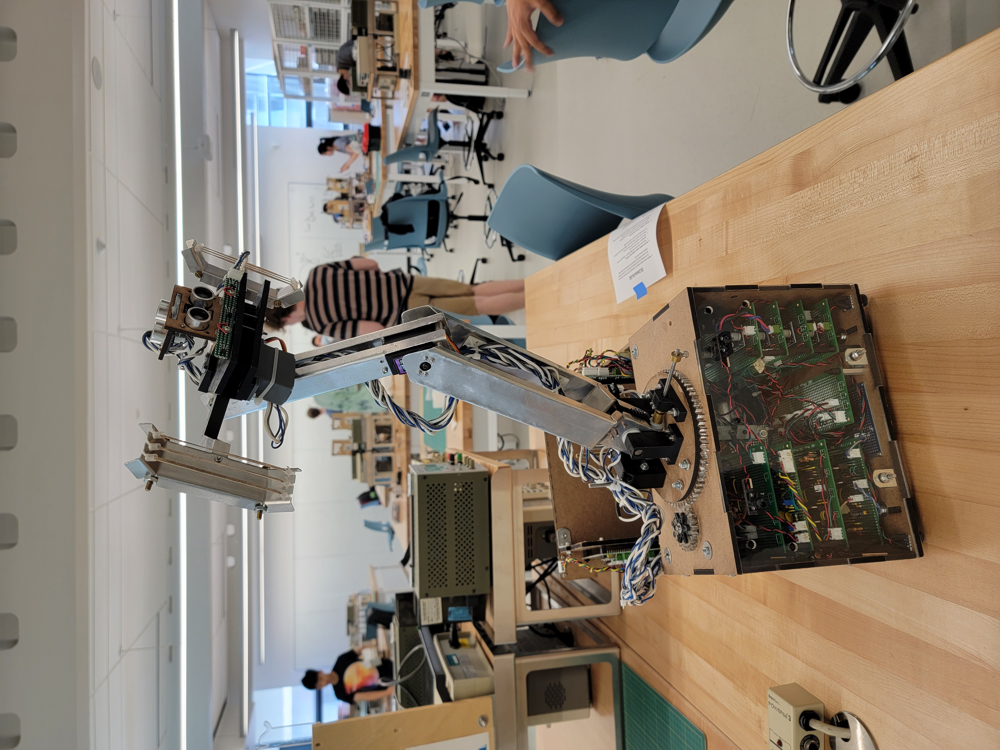

### What Is It
A 2nd year Engineering Physics robotics project built from 4 weeks of sleepless nights, many MANY cups of coffee, and the support of amazing TAs (and teammates!).

The challenge was to build a treasure-hunting robot completely from scratch that could recover lost treasures from temple ruins. To do so, the robot would need to follow tape along a ramp, cross a 6” chicken wire gap, differentiate and follow infrared signals, and pick up irregularly shaped treasure statues positioned on 2” pedestals - all in under 2 minutes.


### Our Design
After many long meetings in the basement of the UBC Hebb building, we eventually settled on 3 DOF robotic arm design with rear-wheel drive. Here is a quick recap of CHONKY's evolution (music to come).



On the mechanical side, we had an arm that consisted of 3 independent joints, encoded using potentiometers and DC motors to provide position feedback and reinforced with high gear ratios (eg. 40:1) to withstand heavy loading. Our chassis was primarily cut from hardboard, and our servo-actuated claw was wrapped with rubber bands to provide better grasp on oddly shaped objects.

My contributions were mostly on the electrical and software end of the project. I helped breadboard the initial IR filtration and tape-following circuits, soldered the power distribution boards, and designed the architecture for our software system.


  
  
  
  
  
  
  
  
  
  
  
  


### Software Architecture
We built our software using C++ and the Arduino Framework, which we then flashed onto a STM32 Bluepill microcontroller. To make our codebase as modular and easy-to-test as possible, we decided to use a finite state machine to organize the control logic and packed lower-level functionalities into smaller driver modules.

Soon enough, we realized that with 15 sensors and 9 motors, we were running out of I/O pins on a single Bluepill. To pivot, we took inspiration from some upper years who had competed in the 2018 competition [Order66](https://order66bot.github.io/) to use two Bluepills and establish a master-slave communication protocol. While the master Bluepill was responsible for detecting treasures and actuating the arm, the slave Bluepill was in charge of all things drive and navigation related.

You can find our source code [here](https://github.com/evinli/CHONKY).

One of the most challenging tasks I faced was getting our PID for tape and IR following to work. Despite days of tuning our P, I, and D values, the mechanical response to our software was still super laggy and not improving. Eventually, we realized the problem was not in our software, but rather an issue with our motors and H-bridge circuits. Because how heavy CHONKY was, it turned out the motors could not supply enough torque below a certain speed. This was what caused the jerking-swaying motion in our PID. We also realized that we needed to decrease the capcitance value across the H-bridge so that the motor could discharge faster and change speeds faster. Here is a sneak peak of our PID code.

```cpp
// Get reflectance sensor readings
leftReading = analogRead(LEFT_TAPE_SENSOR);
centreReading = analogRead(CENTER_TAPE_SENSOR);
rightReading = analogRead(RIGHT_TAPE_SENSOR);

// Display readings
#ifndef COMP_MODE
display->write(10, "Left Reading:" + std::to_string(leftReading));
display->write(20, "Centre Reading:" + std::to_string(centreReading));
display->write(30, "Right Reading:" + std::to_string(rightReading));
#endif

// Get tape error
bool leftOnWhite = sensorOnWhite(leftReading, TAPE_WHITE_THRESHOLD);
bool centreOnWhite = sensorOnWhite(centreReading, TAPE_WHITE_THRESHOLD);
bool rightOnWhite = sensorOnWhite(rightReading, TAPE_WHITE_THRESHOLD);
error = getTapeError(leftOnWhite, centreOnWhite, rightOnWhite);

P = error;
I += error;
D = error - lastError;
lastError = error;

// (+) modMotorSpeed = tilting right = correct to the left
// (-) modMotorSpeed = tilting left = correct to the right
int modMotorSpeed = P*KP + I*KI + D*KD;
int leftMotorSpeed = motorSpeed - modMotorSpeed;
int rightMotorSpeed = motorSpeed + modMotorSpeed;

// Set new motor speeds
leftMotor->setSpeed(leftMotorSpeed);
rightMotor->setSpeed(rightMotorSpeed);
```

### Final Words
This was my first big undergrad project and one that I'll never forget <3!! Shoutout to my team (Asvin, Farhan, and Adarsh) for being the best teammates I could've asked for and for our favorite TA, Rudi - for being our honorary 5th member.

