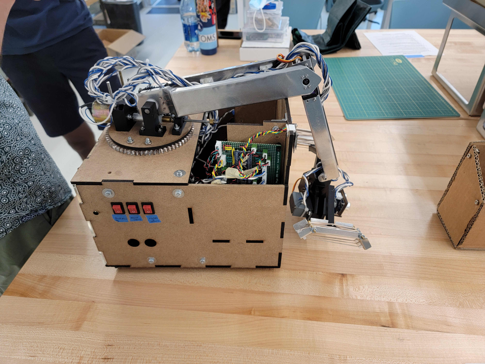

### What Is It
A 2nd year Engineering Physics robotics project. Built from 4 weeks of sleepless nights, many MANY cups of coffee, and the support of amazing TAs. Here is a quick recap of CHONKY's evolution (music to come).



The challenge was to build a treasure-hunting robot completely from scratch that could recover lost treasures from temple ruins. To do so, the robot would need to follow tape along a ramp, cross a 6” chicken wire gap, differentiate and follow infrared signals, and pick up irregularly shaped treasure statues positioned on 2” pedestals - all in under 2 minutes.

### Our Design
After many long meetings in the UBC Hebb basement, we eventually settled on 3 DOF robotic arm design with rear-wheel drive.

On the mechanical side, we had an arm that consisted of 3 independent joints, encoded using potentiometers and DC motors to provide position feedback and reinforced with high gear ratios (eg. 40:1) to withstand heavy loading. Our chassis was primarily laser cut from hardboard, and our servo-actuated claw was wrapped with rubber bands to provide better grasp on oddly shaped objects.

My contributions were mostly on the electrical and software end of the project. I helped breadboard the initial IR filtration and tape-following circuits, soldered the power distribution boards, and designed the architecture for our software system.


  
  
  
  
  
  
  
  
  
  
  
  


### Software Architecture

To be added

